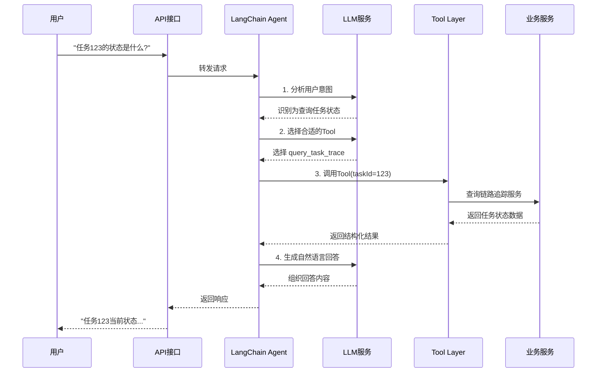
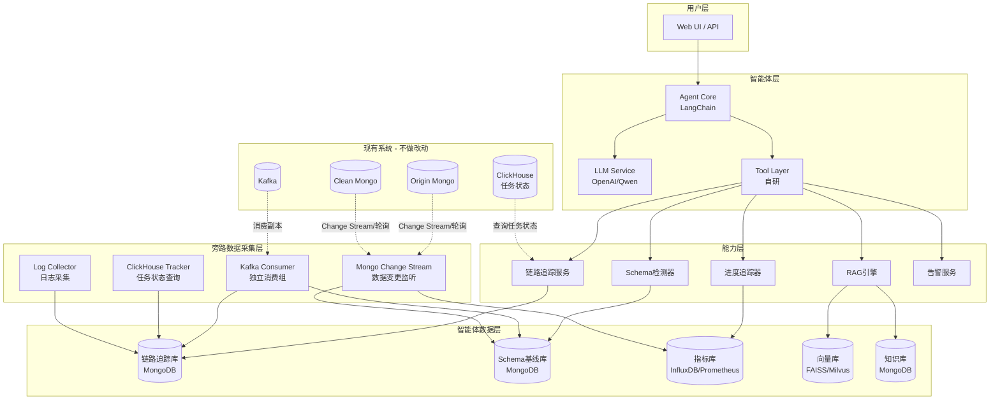
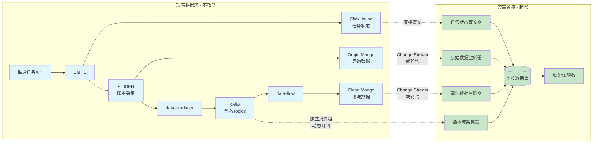

# Design Document

## Overview

数据治理智能体（Data Governance Agent）是一个基于AI的智能助手系统，采用Agent + RAG + 旁路监控的混合架构。系统通过统一的对话接口，为用户提供链路诊断、数据质检、进度监控和知识查询等能力。

核心设计理念：
- **智能体优先**: 通过自然语言理解用户意图，自动编排后端能力
- **旁路无侵入**: 通过消费数据副本、监听变更流等方式，不改动现有服务
- **实时感知**: 基于流式处理实现数据结构变化的实时检测
- **知识驱动**: 构建数据中心知识图谱，支撑快速查询和智能推理
- **可扩展**: 模块化设计，便于接入新的数据源和能力

## AI框架选型

### 推荐方案：LangChain + 自研Tool层

| 组件 | 选型 | 理由 |
|-----|------|------|
| Agent框架 | LangChain | 生态丰富，工具链完善，支持多种Agent模式 |
| RAG引擎 | LangChain + FAISS/Milvus | 与Agent框架统一，向量检索成熟 |
| LLM服务 | OpenAI API / Qwen / GLM | 可根据成本和私有化需求选择 |
| Tool层 | 自研 | 封装与现有系统的集成逻辑，保持灵活性 |

### 备选方案对比

| 框架 | 优势 | 劣势 | 适用场景 |
|-----|------|------|---------|
| LangChain | 生态丰富，灵活 | 学习曲线较陡 | 需要定制化的场景 |
| Dify | 开箱即用，可视化 | 定制性受限 | 快速验证，低代码需求 |
| LlamaIndex | RAG能力强 | Agent能力弱 | 纯知识库查询 |
| Semantic Kernel | 企业级，多语言 | 生态较小 | .NET/Java技术栈 |

## 无侵入集成架构

### 设计原则

**现有系统零改动**：所有监控、质检能力通过旁路方式实现，不修改UMPS、SPIDER、data-producer、data-flow等现有服务的代码。

### 集成策略

| 监控目标 | 集成方式 | 数据来源 | 说明 |
|---------|---------|---------|------|
| 任务状态 | ClickHouse查询 | ClickHouse | 直接查询任务状态表，支持实时和批量查询 |
| 数据流动 | Kafka Consumer | Kafka | 新建独立消费组，支持动态Topic发现和订阅 |
| 数据结构 | MongoDB监听/轮询 | Origin/Clean Mongo | 优先使用Change Stream，降级到轮询方案 |
| 服务异常 | 日志采集 | 服务日志文件 | 通过Filebeat/Fluentd采集，或接入现有ELK |
| 处理进度 | ClickHouse查询 | ClickHouse | 查询任务处理统计表 |

## 旁路监控实现详解

### 1. Kafka 动态Topic消费

**原理**: Kafka支持多个消费组同时消费同一个Topic，每个消费组独立维护offset。对于动态增减的Topic，通过Topic发现机制自动订阅。

```
现有系统:  data-producer --> Kafka Topics (动态) --> data-flow (consumer-group: data-flow-group)
                                    |
旁路监控:                           +--> 监控服务 (consumer-group: monitor-group, 动态订阅)
```

**实现代码示例**:

```typescript
import { Kafka } from 'kafkajs';

class DynamicKafkaMonitor {
  private kafka = new Kafka({ brokers: ['kafka:9092'] });
  private consumer = this.kafka.consumer({ groupId: 'data-governance-monitor' });
  private subscribedTopics = new Set<string>();
  private topicPatterns = [/^raw-data-.*/, /^processed-data-.*/]; // 配置需要监控的Topic模式
  
  async start() {
    await this.consumer.connect();
    
    // 启动Topic发现定时任务
    setInterval(() => this.discoverAndSubscribeTopics(), 60000); // 每分钟检查一次
    
    // 初始订阅
    await this.discoverAndSubscribeTopics();
    
    // 开始消费
    await this.consumer.run({
      eachMessage: async ({ topic, message }) => {
        const data = JSON.parse(message.value.toString());
        
        // 1. Schema检测
        await schemaDetector.analyze(topic, data);
        
        // 2. 链路追踪记录
        await traceService.recordDataFlow(message.key, data);
        
        // 3. 进度统计
        await progressTracker.increment(topic);
      }
    });
  }
  
  private async discoverAndSubscribeTopics() {
    try {
      // 1. 获取所有Topic
      const admin = this.kafka.admin();
      await admin.connect();
      const allTopics = await admin.listTopics();
      await admin.disconnect();
      
      // 2. 过滤需要监控的Topic
      const targetTopics = allTopics.filter(topic => 
        this.topicPatterns.some(pattern => pattern.test(topic))
      );
      
      // 3. 找出新增的Topic
      const newTopics = targetTopics.filter(topic => 
        !this.subscribedTopics.has(topic)
      );
      
      // 4. 动态订阅新Topic
      if (newTopics.length > 0) {
        console.log(`发现新Topic: ${newTopics.join(', ')}`);
        await this.consumer.subscribe({ topics: newTopics });
        newTopics.forEach(topic => this.subscribedTopics.add(topic));
      }
    } catch (error) {
      console.error('Topic发现失败:', error);
    }
  }
}
```

### 2. MongoDB 兼容性监听

**原理**: 根据MongoDB版本选择最佳监听策略，优先使用Change Stream，降级到轮询方案。

```
MongoDB >= 3.6:  Change Stream (推荐)
MongoDB >= 3.2:  Oplog Tailing (需要replica set)
MongoDB < 3.2:   定时轮询 (兜底方案)
```

**实现代码示例**:

```typescript
import { MongoClient } from 'mongodb';

class AdaptiveMongoMonitor {
  private client: MongoClient;
  private strategy: MongoMonitorStrategy;
  
  async initialize() {
    this.client = new MongoClient('mongodb://localhost:27017');
    await this.client.connect();
    
    // 检测MongoDB版本并选择策略
    const adminDb = this.client.db('admin');
    const buildInfo = await adminDb.command({ buildInfo: 1 });
    const version = buildInfo.version;
    
    if (this.compareVersion(version, '3.6.0') >= 0) {
      console.log('使用Change Stream策略');
      this.strategy = new ChangeStreamStrategy(this.client);
    } else if (this.compareVersion(version, '3.2.0') >= 0) {
      console.log('使用Oplog Tailing策略');
      this.strategy = new OplogTailingStrategy(this.client);
    } else {
      console.log('使用定时轮询策略');
      this.strategy = new PollingStrategy(this.client);
    }
    
    await this.strategy.start();
  }
  
  private compareVersion(v1: string, v2: string): number {
    const parts1 = v1.split('.').map(Number);
    const parts2 = v2.split('.').map(Number);
    
    for (let i = 0; i < Math.max(parts1.length, parts2.length); i++) {
      const part1 = parts1[i] || 0;
      const part2 = parts2[i] || 0;
      if (part1 > part2) return 1;
      if (part1 < part2) return -1;
    }
    return 0;
  }
}

// Change Stream策略 (MongoDB 3.6+)
class ChangeStreamStrategy implements MongoMonitorStrategy {
  constructor(private client: MongoClient) {}
  
  async start() {
    const db = this.client.db('data_center');
    
    // 监听原始数据集合
    const originStream = db.collection('origin_data').watch([
      { $match: { operationType: { $in: ['insert', 'update'] } } }
    ], { fullDocument: 'updateLookup' });
    
    originStream.on('change', async (change) => {
      await this.handleDataChange('origin_data', change.fullDocument);
    });
    
    // 监听清洗数据集合
    const cleanStream = db.collection('clean_data').watch([
      { $match: { operationType: 'insert' } }
    ]);
    
    cleanStream.on('change', async (change) => {
      await this.handleDataChange('clean_data', change.fullDocument);
    });
  }
  
  private async handleDataChange(collection: string, doc: any) {
    // 1. Schema检测
    const schemaChanges = await schemaDetector.detectChanges(collection, doc);
    
    if (schemaChanges.length > 0) {
      await alertService.sendAlert({
        type: 'schema_change',
        severity: 'warning',
        title: `数据结构变化: ${collection}`,
        description: `检测到 ${schemaChanges.length} 处变化`,
        metadata: { changes: schemaChanges }
      });
    }
    
    // 2. 进度统计
    await progressTracker.recordInsert(collection);
  }
}

// 定时轮询策略 (兜底方案)
class PollingStrategy implements MongoMonitorStrategy {
  private lastCheckTime = new Date();
  
  constructor(private client: MongoClient) {}
  
  async start() {
    const db = this.client.db('data_center');
    
    // 每30秒轮询一次
    setInterval(async () => {
      await this.pollCollection(db, 'origin_data');
      await this.pollCollection(db, 'clean_data');
      this.lastCheckTime = new Date();
    }, 30000);
  }
  
  private async pollCollection(db: any, collectionName: string) {
    try {
      // 查询最近插入的数据
      const recentDocs = await db.collection(collectionName).find({
        createdAt: { $gte: this.lastCheckTime }
      }).limit(1000).toArray(); // 限制每次处理1000条
      
      for (const doc of recentDocs) {
        await schemaDetector.analyze(collectionName, doc);
        await progressTracker.recordInsert(collectionName);
      }
    } catch (error) {
      console.error(`轮询 ${collectionName} 失败:`, error);
    }
  }
}
```

### 3. ClickHouse 任务状态查询

**原理**: 任务状态信息已存储在ClickHouse中，直接查询即可，无需Redis监听。

```
现有系统:  UMPS/SPIDER/data-flow --> ClickHouse (任务状态表)
                                          |
旁路监控:                                 +--> 直接查询 (只读)
```

**实现代码示例**:

```typescript
import { ClickHouse } from 'clickhouse';

class ClickHouseTaskTracker {
  private clickhouse = new ClickHouse({
    url: 'http://localhost',
    port: 8123,
    debug: false,
    basicAuth: null,
    isUseGzip: false,
    format: "json",
    config: {
      session_timeout: 60,
      output_format_json_quote_64bit_integers: 0,
      enable_http_compression: 0,
      database: 'data_center'
    }
  });
  
  async getTaskTrace(taskId: string): Promise<TaskTrace> {
    const query = `
      SELECT 
        task_id,
        service_name,
        operation,
        status,
        start_time,
        end_time,
        error_message,
        metadata
      FROM task_trace_log 
      WHERE task_id = '${taskId}'
      ORDER BY start_time ASC
    `;
    
    const rows = await this.clickhouse.query(query).toPromise();
    return this.buildTaskTrace(rows);
  }
  
  async getTaskProgress(taskId: string): Promise<TaskProgress> {
    const query = `
      SELECT 
        stage,
        processed_count,
        total_count,
        error_count,
        start_time,
        end_time
      FROM task_progress_log 
      WHERE task_id = '${taskId}'
      ORDER BY start_time ASC
    `;
    
    const rows = await this.clickhouse.query(query).toPromise();
    return this.buildTaskProgress(taskId, rows);
  }
  
  async getTaskStatistics(filter: StatsFilter): Promise<Statistics> {
    const query = `
      SELECT 
        COUNT(*) as task_count,
        AVG(processing_time_seconds) as avg_processing_time,
        SUM(CASE WHEN final_status = 'completed' THEN 1 ELSE 0 END) / COUNT(*) as success_rate,
        SUM(processed_records) as total_processed_records
      FROM task_summary 
      WHERE date >= '${filter.startDate}' AND date <= '${filter.endDate}'
    `;
    
    const result = await this.clickhouse.query(query).toPromise();
    return {
      period: { start: new Date(filter.startDate), end: new Date(filter.endDate) },
      taskCount: result[0].task_count,
      successRate: result[0].success_rate,
      avgProcessingTime: result[0].avg_processing_time,
      dataVolume: {
        totalRecords: result[0].total_processed_records,
        totalSize: 0 // 如果有大小统计的话
      }
    };
  }
  
  private buildTaskTrace(rows: any[]): TaskTrace {
    const stages: TraceStage[] = rows.map(row => ({
      service: row.service_name,
      operation: row.operation,
      status: row.status,
      startTime: new Date(row.start_time),
      endTime: row.end_time ? new Date(row.end_time) : undefined,
      metadata: JSON.parse(row.metadata || '{}')
    }));
    
    const firstRow = rows[0];
    return {
      taskId: firstRow.task_id,
      stages,
      status: this.determineOverallStatus(stages),
      startTime: new Date(firstRow.start_time),
      endTime: stages[stages.length - 1]?.endTime,
      errorInfo: rows.find(r => r.error_message) ? {
        message: rows.find(r => r.error_message).error_message,
        service: rows.find(r => r.error_message).service_name
      } : undefined
    };
  }
  
  private determineOverallStatus(stages: TraceStage[]): TraceStatus {
    if (stages.some(s => s.status === 'failed')) return 'failed';
    if (stages.some(s => s.status === 'running')) return 'running';
    if (stages.every(s => s.status === 'success')) return 'completed';
    return 'pending';
  }
}

## 性能影响分析

### 对现有系统的影响评估

| 组件 | 影响程度 | 原因分析 | 优化建议 |
|-----|---------|---------|---------|
| **Kafka** | ⭐ 极低 | 独立消费组，Broker只需多维护一份offset元数据，动态Topic订阅不影响现有消费 | 配置Topic模式过滤，避免订阅无关Topic |
| **MongoDB** | ⭐⭐ 低 | Change Stream基于oplog，只读操作；轮询方案可控制频率和数量 | 优先使用Change Stream，轮询时限制每次查询数量 |
| **ClickHouse** | ⭐ 极低 | 纯查询操作，不写入数据，对OLAP系统影响微乎其微 | 合理设置查询频率，避免过于频繁的查询 |

### 关键保障措施

1. **所有操作只读**: 旁路监控不会写入现有系统的任何数据
2. **独立资源**: 监控服务使用独立的数据库存储采集的数据
3. **背压控制**: Kafka消费速度可调，MongoDB轮询频率可控
4. **故障隔离**: 监控服务故障不影响现有数据流
5. **版本兼容**: MongoDB监听策略根据版本自动降级，确保兼容性

### 资源消耗估算

假设日均处理100万条数据：

| 资源 | 估算消耗 | 说明 |
|-----|---------|------|
| CPU | 0.5-1 Core | 主要用于Schema检测和数据解析 |
| 内存 | 512MB-1GB | 缓存Schema基线和最近的追踪数据 |
| 存储 | 10-50GB/月 | 链路追踪和Schema历史记录 |
| 网络 | 与现有流量相当 | 消费Kafka数据的副本 |

## LangChain 整合详解

### 整体流程



### 完整代码示例

```typescript
import { ChatOpenAI } from '@langchain/openai';
import { AgentExecutor, createToolCallingAgent } from 'langchain/agents';
import { DynamicStructuredTool } from '@langchain/core/tools';
import { ChatPromptTemplate } from '@langchain/core/prompts';
import { z } from 'zod';

// ============ 1. 定义Tools ============

// 链路追踪Tool
const traceQueryTool = new DynamicStructuredTool({
  name: 'query_task_trace',
  description: '查询任务在UMPS、SPIDER、data-producer、data-flow各节点的执行状态和链路信息。当用户询问任务状态、执行情况、是否成功时使用此工具。',
  schema: z.object({
    taskId: z.string().describe('任务ID，通常是数字或UUID格式'),
  }),
  func: async ({ taskId }) => {
    const trace = await traceService.getTaskTrace(taskId);
    return JSON.stringify(trace, null, 2);
  },
});

// Schema检测Tool
const schemaCheckTool = new DynamicStructuredTool({
  name: 'check_schema_changes',
  description: '检查数据源的Schema(字段结构)变化历史。当用户询问数据结构变化、字段变更、新增字段时使用此工具。',
  schema: z.object({
    dataSource: z.string().describe('数据源名称，如 origin_data, clean_data'),
    days: z.number().optional().describe('查询最近几天的变化，默认7天'),
  }),
  func: async ({ dataSource, days = 7 }) => {
    const changes = await schemaDetector.getRecentChanges(dataSource, days);
    return JSON.stringify(changes, null, 2);
  },
});

// 进度查询Tool
const progressQueryTool = new DynamicStructuredTool({
  name: 'query_progress',
  description: '查询任务执行进度或数据处理统计信息。当用户询问处理了多少数据、进度如何、统计信息时使用此工具。',
  schema: z.object({
    taskId: z.string().optional().describe('任务ID，不填则查询整体统计'),
    startDate: z.string().optional().describe('开始日期，格式YYYY-MM-DD'),
    endDate: z.string().optional().describe('结束日期，格式YYYY-MM-DD'),
  }),
  func: async (params) => {
    if (params.taskId) {
      const progress = await progressTracker.getTaskProgress(params.taskId);
      return JSON.stringify(progress, null, 2);
    } else {
      const stats = await progressTracker.getStatistics(params);
      return JSON.stringify(stats, null, 2);
    }
  },
});

// 知识库查询Tool
const knowledgeQueryTool = new DynamicStructuredTool({
  name: 'search_knowledge',
  description: '搜索数据中心的API文档、字段定义、能力说明等知识库内容。当用户询问API接口、字段含义、系统能力时使用此工具。',
  schema: z.object({
    query: z.string().describe('搜索关键词或问题'),
    type: z.enum(['api', 'field', 'capability', 'all']).optional().describe('搜索类型'),
  }),
  func: async ({ query, type = 'all' }) => {
    const results = await ragEngine.query(query, { type });
    return JSON.stringify(results, null, 2);
  },
});

// ============ 2. 创建Agent ============

const llm = new ChatOpenAI({ 
  model: 'gpt-4',  // 或使用其他模型
  temperature: 0,  // 降低随机性，提高一致性
});

const tools = [traceQueryTool, schemaCheckTool, progressQueryTool, knowledgeQueryTool];

const prompt = ChatPromptTemplate.fromMessages([
  ['system', `你是数据治理智能助手，帮助用户查询数据中心的任务状态、数据质量、处理进度等信息。

你可以使用以下工具：
- query_task_trace: 查询任务执行状态和链路信息
- check_schema_changes: 检查数据结构变化
- query_progress: 查询处理进度和统计
- search_knowledge: 搜索API文档和知识库

请根据用户问题选择合适的工具，并用清晰的中文回答。如果需要多个工具配合，可以依次调用。`],
  ['human', '{input}'],
  ['placeholder', '{agent_scratchpad}'],
]);

const agent = createToolCallingAgent({ llm, tools, prompt });
const executor = new AgentExecutor({ 
  agent, 
  tools,
  verbose: true,  // 开发时开启，查看Agent思考过程
});

// ============ 3. 处理用户请求 ============

// API接口示例
app.post('/api/chat', async (req, res) => {
  const { sessionId, message } = req.body;
  
  try {
    const result = await executor.invoke({
      input: message,
    });
    
    res.json({
      sessionId,
      response: result.output,
    });
  } catch (error) {
    res.status(500).json({ error: '处理请求时发生错误' });
  }
});

// 使用示例
// 用户: "任务abc123的执行状态是什么？"
// Agent思考: 用户想查询任务状态 -> 调用 query_task_trace(taskId='abc123')
// Agent回答: "任务abc123当前状态为'cleaning'，已完成UMPS下发、SPIDER采集、data-producer生产，正在data-flow清洗阶段，预计还需2分钟完成。"
```

### 多轮对话支持

```typescript
import { BufferMemory } from 'langchain/memory';

// 添加会话记忆
const memory = new BufferMemory({
  memoryKey: 'chat_history',
  returnMessages: true,
});

const executorWithMemory = new AgentExecutor({ 
  agent, 
  tools,
  memory,
});

// 支持上下文理解
// 用户: "任务123的状态"
// Agent: "任务123正在清洗阶段..."
// 用户: "它的Schema有变化吗？"  <- Agent理解"它"指的是任务123相关的数据
// Agent: 调用 check_schema_changes
```

## Architecture

### 整体架构图



### 旁路集成架构详图



## Components and Interfaces

### 1. 旁路数据采集组件

#### 1.1 Kafka Consumer (数据流采集器)

独立消费组，消费现有Kafka topic的数据副本，不影响data-flow的正常消费。

```typescript
interface KafkaDataCollector {
  // 启动消费
  start(topics: string[]): Promise<void>;
  
  // 停止消费
  stop(): Promise<void>;
  
  // 注册数据处理器
  registerHandler(handler: DataHandler): void;
}

interface DataHandler {
  // 处理数据记录，用于Schema检测和链路追踪
  handle(record: KafkaRecord): Promise<void>;
}

interface KafkaRecord {
  topic: string;
  partition: number;
  offset: number;
  key: string;
  value: unknown;
  timestamp: Date;
  headers: Record<string, string>;
}
```

#### 1.2 ClickHouse Task Tracker (任务状态查询器)

直接查询ClickHouse中的任务状态表，获取任务链路和统计信息。

```typescript
interface ClickHouseTaskTracker {
  // 获取任务链路追踪
  getTaskTrace(taskId: string): Promise<TaskTrace>;
  
  // 获取任务进度
  getTaskProgress(taskId: string): Promise<TaskProgress>;
  
  // 获取统计信息
  getStatistics(filter: StatsFilter): Promise<Statistics>;
}

interface StatsFilter {
  startDate: string;
  endDate: string;
  serviceNames?: string[];
  taskTypes?: string[];
}
```

#### 1.3 MongoDB Change Stream (数据变更监听器)

监听MongoDB集合的变更，用于Schema检测和进度统计。

```typescript
interface MongoChangeStreamWatcher {
  // 监听集合变更
  watch(collection: string, options?: WatchOptions): ChangeStream;
  
  // 注册变更处理器
  onInsert(handler: (doc: Document) => void): void;
  onUpdate(handler: (change: UpdateChange) => void): void;
  onDelete(handler: (id: string) => void): void;
}

interface WatchOptions {
  // 只监听特定操作
  operationTypes?: ('insert' | 'update' | 'delete')[];
  // 过滤条件
  filter?: Record<string, unknown>;
  // 从指定时间点开始
  startAtOperationTime?: Date;
}
```

### 2. Agent Core (智能体核心)

基于LangChain实现，负责接收用户请求，协调各模块完成任务。

```typescript
interface AgentCore {
  // 处理用户消息
  processMessage(message: UserMessage): Promise<AgentResponse>;
  
  // 获取会话上下文
  getContext(sessionId: string): ConversationContext;
  
  // 注册Tool
  registerTool(tool: AgentTool): void;
}

// LangChain Tool定义
interface AgentTool {
  name: string;
  description: string;
  schema: ZodSchema;  // 参数Schema
  execute: (params: unknown) => Promise<unknown>;
}

interface UserMessage {
  sessionId: string;
  content: string;
  attachments?: Attachment[];
  metadata?: Record<string, unknown>;
}

interface AgentResponse {
  content: string;
  actions?: ActionResult[];
  suggestions?: string[];
  references?: Reference[];
}
```

### 3. Tool Layer (工具层)

封装与各能力模块的交互，供Agent调用。

```typescript
// 链路诊断Tool
const traceQueryTool: AgentTool = {
  name: 'query_task_trace',
  description: '查询任务在各服务节点的执行状态和链路信息',
  schema: z.object({
    taskId: z.string().describe('任务ID'),
  }),
  execute: async ({ taskId }) => traceService.getTaskTrace(taskId),
};

// Schema检测Tool
const schemaCheckTool: AgentTool = {
  name: 'check_schema_changes',
  description: '检查数据源的Schema变化历史',
  schema: z.object({
    dataSource: z.string().describe('数据源名称'),
    startTime: z.string().optional().describe('开始时间'),
  }),
  execute: async ({ dataSource, startTime }) => 
    schemaDetector.getSchemaHistory(dataSource, startTime),
};

// 进度查询Tool
const progressQueryTool: AgentTool = {
  name: 'query_progress',
  description: '查询任务执行进度和统计信息',
  schema: z.object({
    taskId: z.string().optional().describe('任务ID'),
    timeRange: z.object({
      start: z.string(),
      end: z.string(),
    }).optional().describe('时间范围'),
  }),
  execute: async (params) => progressTracker.query(params),
};

// 知识查询Tool
const knowledgeQueryTool: AgentTool = {
  name: 'search_knowledge',
  description: '搜索API文档、字段定义、能力说明等知识库内容',
  schema: z.object({
    query: z.string().describe('搜索关键词或问题'),
    type: z.enum(['api', 'field', 'capability', 'all']).optional(),
  }),
  execute: async ({ query, type }) => ragEngine.query(query, { type }),
};
```

### 5. Trace Service (链路追踪服务)

基于旁路采集的数据，提供跨服务的链路追踪能力。

```typescript
interface TraceService {
  // 获取任务链路
  getTaskTrace(taskId: string): Promise<TaskTrace>;
  
  // 获取服务状态
  getServiceStatus(serviceName: string): Promise<ServiceStatus>;
  
  // 搜索异常链路
  searchAbnormalTraces(filter: TraceFilter): Promise<TaskTrace[]>;
}

interface TaskTrace {
  taskId: string;
  stages: TraceStage[];
  status: TraceStatus;
  startTime: Date;
  endTime?: Date;
  errorInfo?: ErrorInfo;
}

interface TraceStage {
  service: string;
  operation: string;
  status: 'pending' | 'running' | 'success' | 'failed';
  startTime: Date;
  endTime?: Date;
  metadata: Record<string, unknown>;
}
```

### 6. Schema Detector (Schema检测器)

基于MongoDB Change Stream采集的数据，检测数据结构变化。

```typescript
interface SchemaDetector {
  // 检测Schema变化
  detectChanges(dataSource: string, newData: unknown): Promise<SchemaChange[]>;
  
  // 获取Schema历史
  getSchemaHistory(dataSource: string): Promise<SchemaVersion[]>;
  
  // 注册Schema基线
  registerBaseline(dataSource: string, schema: SchemaDefinition): Promise<void>;
}

interface SchemaChange {
  changeType: 'field_added' | 'field_removed' | 'type_changed' | 'structure_changed';
  path: string;
  oldValue?: unknown;
  newValue?: unknown;
  severity: 'info' | 'warning' | 'critical';
  detectedAt: Date;
}

interface SchemaDefinition {
  fields: FieldDefinition[];
  version: string;
  dataSource: string;
}

interface FieldDefinition {
  name: string;
  type: string;
  required: boolean;
  description?: string;
  children?: FieldDefinition[];
}
```

### 7. Progress Tracker (进度追踪器)

基于旁路采集的数据，追踪数据流处理进度。

```typescript
interface ProgressTracker {
  // 获取任务进度
  getTaskProgress(taskId: string): Promise<TaskProgress>;
  
  // 获取统计信息
  getStatistics(filter: StatsFilter): Promise<Statistics>;
  
  // 订阅进度更新
  subscribe(taskId: string, callback: ProgressCallback): Subscription;
}

interface TaskProgress {
  taskId: string;
  overallProgress: number;
  stages: StageProgress[];
  estimatedCompletion?: Date;
}

interface StageProgress {
  stage: string;
  processed: number;
  total: number;
  progress: number;
  throughput: number;
  errors: number;
}

interface Statistics {
  period: DateRange;
  taskCount: number;
  successRate: number;
  avgProcessingTime: number;
  dataVolume: DataVolume;
}
```

### 8. RAG Engine (RAG引擎)

基于检索增强生成的知识查询。

```typescript
interface RAGEngine {
  // 查询知识库
  query(question: string, context?: QueryContext): Promise<RAGResponse>;
  
  // 索引文档
  indexDocument(document: Document): Promise<void>;
  
  // 更新知识库
  updateKnowledge(update: KnowledgeUpdate): Promise<void>;
}

interface RAGResponse {
  answer: string;
  sources: Source[];
  confidence: number;
  relatedQuestions?: string[];
}

interface Source {
  type: 'api_doc' | 'field_def' | 'guide' | 'faq';
  title: string;
  content: string;
  url?: string;
  relevance: number;
}
```

### 9. Alert Service (告警服务)

处理异常告警。

```typescript
interface AlertService {
  // 发送告警
  sendAlert(alert: Alert): Promise<void>;
  
  // 获取告警历史
  getAlertHistory(filter: AlertFilter): Promise<Alert[]>;
  
  // 配置告警规则
  configureRule(rule: AlertRule): Promise<void>;
}

interface Alert {
  id: string;
  type: AlertType;
  severity: 'info' | 'warning' | 'critical';
  title: string;
  description: string;
  source: string;
  timestamp: Date;
  metadata: Record<string, unknown>;
}

type AlertType = 'schema_change' | 'task_failure' | 'data_quality' | 'performance';
```

## Data Models

### 任务模型

```typescript
interface Task {
  id: string;
  type: string;
  source: string;
  status: TaskStatus;
  priority: number;
  createdAt: Date;
  updatedAt: Date;
  metadata: Record<string, unknown>;
}

type TaskStatus = 'pending' | 'dispatched' | 'collecting' | 'producing' | 'cleaning' | 'completed' | 'failed';
```

### 数据源模型

```typescript
interface DataSource {
  id: string;
  name: string;
  platform: string;
  originCollection: string;
  cleanCollection: string;
  schema: SchemaDefinition;
  cleaningRules: CleaningRule[];
  status: 'active' | 'inactive';
}

interface CleaningRule {
  id: string;
  name: string;
  sourceField: string;
  targetField: string;
  transformation: string;
  enabled: boolean;
}
```

### 知识条目模型

```typescript
interface KnowledgeEntry {
  id: string;
  type: 'api' | 'field' | 'capability' | 'guide';
  title: string;
  content: string;
  tags: string[];
  embedding?: number[];
  createdAt: Date;
  updatedAt: Date;
}

interface APIEntry extends KnowledgeEntry {
  type: 'api';
  service: string;
  endpoint: string;
  method: string;
  parameters: ParameterDef[];
  response: ResponseDef;
  examples: Example[];
}

interface FieldEntry extends KnowledgeEntry {
  type: 'field';
  collection: string;
  fieldPath: string;
  dataType: string;
  description: string;
  sampleValues?: unknown[];
}
```

### 会话上下文模型

```typescript
interface ConversationContext {
  sessionId: string;
  userId: string;
  history: Message[];
  currentIntent?: ParsedIntent;
  activeTask?: string;
  preferences: UserPreferences;
}

interface Message {
  role: 'user' | 'assistant';
  content: string;
  timestamp: Date;
  metadata?: Record<string, unknown>;
}
```


## Correctness Properties

*A property is a characteristic or behavior that should hold true across all valid executions of a system-essentially, a formal statement about what the system should do. Properties serve as the bridge between human-readable specifications and machine-verifiable correctness guarantees.*

### Property 1: 任务状态查询完整性

*For any* 有效的任务ID，查询该任务状态时，返回结果应包含UMPS、SPIDER、data-producer、data-flow四个节点的状态信息，且每个节点状态为有效枚举值。

**Validates: Requirements 1.1**

### Property 2: 异常服务识别准确性

*For any* 包含异常的任务链路，系统应能识别出至少一个异常服务，且返回的异常详情包含服务名称、异常类型和发生时间。

**Validates: Requirements 1.2**

### Property 3: 链路追踪完整性

*For any* 失败任务的诊断请求，返回的链路追踪信息应包含从任务下发到失败点的所有阶段，且阶段按时间顺序排列。

**Validates: Requirements 1.3, 1.5**

### Property 4: Schema变化检测覆盖性

*For any* 数据结构变化（新增字段、字段缺失、类型变化），Schema检测器应能检测到该变化，返回的变化信息包含变化类型、字段路径和严重程度。

**Validates: Requirements 2.1, 2.2, 2.3, 2.4**

### Property 5: 必需字段缺失阻断

*For any* 缺失必需字段的数据记录，系统应将其标记为异常状态，且该记录不应出现在下游清洗集合中。

**Validates: Requirements 2.3**

### Property 6: Schema历史时间线有序性

*For any* 数据源的Schema变更历史查询，返回的变更记录应按时间降序排列，且每条记录包含变更时间、变更类型和变更详情。

**Validates: Requirements 2.5**

### Property 7: 进度信息完整性

*For any* 正在执行或已完成的任务，进度查询应返回各阶段的处理数量、耗时和进度百分比，且进度百分比在0-100范围内。

**Validates: Requirements 3.1, 3.4**

### Property 8: 统计信息完整性

*For any* 有效的时间范围查询，统计结果应包含任务数、成功率、平均处理时间和数据量，且所有数值为非负数。

**Validates: Requirements 3.2**

### Property 9: 积压检测准确性

*For any* 存在积压的数据流，系统应能识别积压节点，返回的积压信息包含节点名称、积压数量和预估恢复时间。

**Validates: Requirements 3.3**

### Property 10: API查询结果完整性

*For any* 有效的服务名称查询，返回的API信息应包含接口列表，且每个接口包含端点、方法、参数说明。

**Validates: Requirements 4.1**

### Property 11: 字段定义查询完整性

*For any* 有效的集合名称查询，返回结果应同时包含原始集合和沉淀集合的字段结构，且每个字段包含名称、类型和描述。

**Validates: Requirements 4.2**

### Property 12: 能力边界查询完整性

*For any* 能力边界查询请求，返回结果应包含支持的数据源列表、清洗规则列表和输出格式列表。

**Validates: Requirements 4.3**

### Property 13: 文档搜索结果格式

*For any* 文档搜索请求，返回的每条结果应包含文档标题、链接和内容摘要，且摘要长度不超过指定限制。

**Validates: Requirements 4.4**

### Property 14: 操作确认机制

*For any* 用户发起的操作请求（非查询类），系统应在执行前返回确认信息，包含操作内容和影响范围描述。

**Validates: Requirements 5.3**

### Property 15: 能力边界响应

*For any* 超出系统能力范围的请求，系统应返回包含限制原因说明和至少一个替代方案的响应。

**Validates: Requirements 5.4**

## Error Handling

### 错误分类

| 错误类型 | 错误码范围 | 处理策略 |
|---------|-----------|---------|
| 参数错误 | 4000-4099 | 返回具体参数校验失败信息 |
| 认证错误 | 4100-4199 | 引导用户重新认证 |
| 资源不存在 | 4400-4499 | 返回友好提示，建议相似资源 |
| 服务不可用 | 5000-5099 | 降级处理，返回缓存数据或提示稍后重试 |
| 超时错误 | 5100-5199 | 异步处理，通知用户结果 |
| 内部错误 | 5900-5999 | 记录日志，返回通用错误信息 |

### 降级策略

```typescript
interface DegradationStrategy {
  // 链路追踪降级：返回最近一次成功的追踪结果
  traceServiceDegraded(taskId: string): Promise<TaskTrace | null>;
  
  // 知识查询降级：返回缓存的热门问答
  ragServiceDegraded(question: string): Promise<RAGResponse>;
  
  // 统计服务降级：返回预计算的统计快照
  statsServiceDegraded(filter: StatsFilter): Promise<Statistics>;
}
```

### 重试机制

- 网络超时：最多重试3次，指数退避（1s, 2s, 4s）
- 服务限流：等待限流窗口后重试
- 临时错误：立即重试1次

### 错误响应格式

```typescript
interface ErrorResponse {
  code: number;
  message: string;
  details?: string;
  suggestions?: string[];
  traceId: string;
  timestamp: Date;
}
```

## Testing Strategy

### 测试框架选择

- **单元测试**: Jest (TypeScript/JavaScript)
- **属性测试**: fast-check (Property-Based Testing)
- **集成测试**: Jest + Supertest
- **E2E测试**: Playwright (可选)

### 单元测试策略

单元测试覆盖以下场景：
- 意图解析器的各类意图识别
- Schema检测器的变化检测逻辑
- 进度计算的边界情况
- 错误处理和降级逻辑

### 属性测试策略

每个正确性属性对应一个属性测试，使用fast-check库实现：

- 配置每个属性测试运行最少100次迭代
- 每个属性测试必须标注对应的正确性属性编号
- 标注格式：`**Feature: data-governance-agent, Property {number}: {property_text}**`

属性测试重点覆盖：
1. 查询结果的完整性验证（Property 1, 7, 8, 10, 11, 12, 13）
2. Schema变化检测的覆盖性（Property 4, 5）
3. 时间序列的有序性（Property 3, 6）
4. 数值范围的有效性（Property 7, 8）
5. 响应格式的一致性（Property 14, 15）

### 测试数据生成

```typescript
// 使用fast-check生成测试数据
import * as fc from 'fast-check';

// 任务ID生成器
const taskIdArb = fc.uuid();

// 任务状态生成器
const taskStatusArb = fc.constantFrom(
  'pending', 'dispatched', 'collecting', 'producing', 'cleaning', 'completed', 'failed'
);

// Schema变化类型生成器
const schemaChangeArb = fc.record({
  changeType: fc.constantFrom('field_added', 'field_removed', 'type_changed'),
  path: fc.string({ minLength: 1, maxLength: 50 }),
  severity: fc.constantFrom('info', 'warning', 'critical')
});

// 时间范围生成器
const dateRangeArb = fc.tuple(fc.date(), fc.date()).map(([a, b]) => 
  a < b ? { start: a, end: b } : { start: b, end: a }
);
```

### 集成测试策略

- 测试Agent Core与各能力模块的集成
- 测试与外部服务（Redis, MongoDB, Kafka）的交互
- 测试端到端的用户查询流程

### 测试覆盖率目标

- 单元测试覆盖率：≥ 80%
- 属性测试：覆盖所有15个正确性属性
- 集成测试：覆盖核心用户场景
