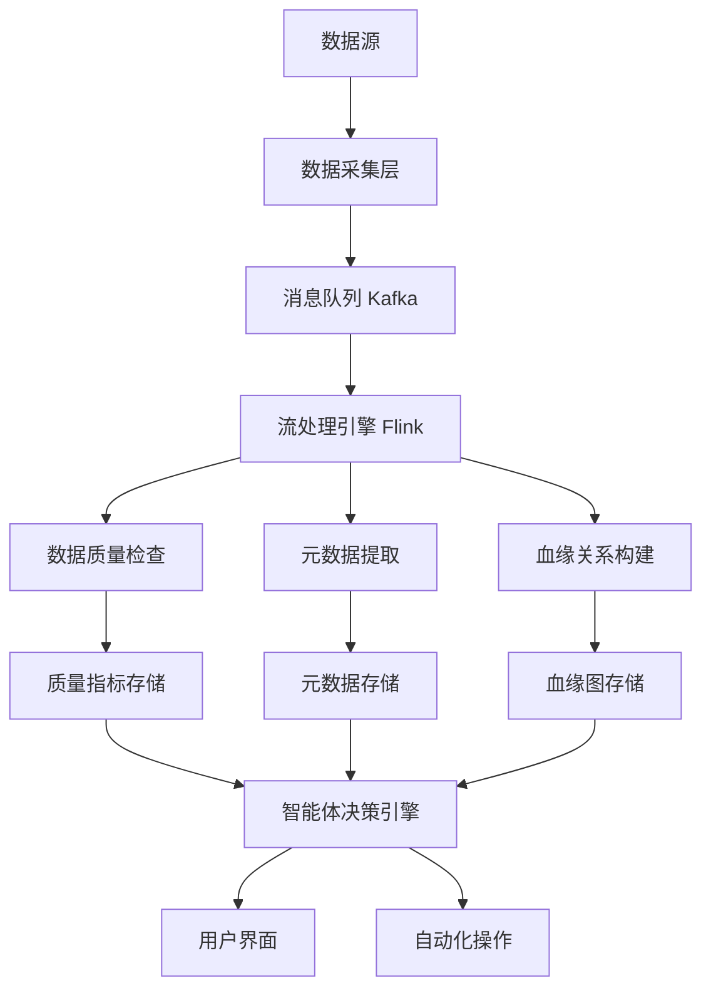

# 数据治理智能体设计文档

## 概述

数据治理智能体是一个基于微服务架构和AI技术的企业级数据治理平台。系统采用事件驱动架构，集成多个专业的数据治理工具，通过智能化的方式提供数据质量监控、元数据管理、合规性检查、数据血缘分析等核心功能。

系统的核心设计理念是"智能化、自动化、可扩展"，通过AI技术降低数据治理的人工成本，提升治理效率和准确性。

## 架构

### 整体架构

系统采用分层微服务架构，包含以下层次：

```
┌─────────────────────────────────────────────────────────────┐
│                    用户交互层                                │
│  ┌─────────────────┐  ┌─────────────────┐  ┌──────────────┐ │
│  │   Web界面       │  │   API网关       │  │  移动端应用   │ │
│  └─────────────────┘  └─────────────────┘  └──────────────┘ │
└─────────────────────────────────────────────────────────────┘
┌─────────────────────────────────────────────────────────────┐
│                    智能体服务层                              │
│  ┌─────────────────┐  ┌─────────────────┐  ┌──────────────┐ │
│  │ 对话管理服务     │  │ 推荐引擎服务     │  │ 工作流引擎   │ │
│  └─────────────────┘  └─────────────────┘  └──────────────┘ │
└─────────────────────────────────────────────────────────────┘
┌─────────────────────────────────────────────────────────────┐
│                    核心业务层                                │
│  ┌─────────────────┐  ┌─────────────────┐  ┌──────────────┐ │
│  │ 数据质量服务     │  │ 元数据服务       │  │ 合规检查服务  │ │
│  │ 数据血缘服务     │  │ 数据分类服务     │  │ 告警通知服务  │ │
│  └─────────────────┘  └─────────────────┘  └──────────────┘ │
└─────────────────────────────────────────────────────────────┘
┌─────────────────────────────────────────────────────────────┐
│                    数据存储层                                │
│  ┌─────────────────┐  ┌─────────────────┐  ┌──────────────┐ │
│  │ 关系型数据库     │  │ 向量数据库       │  │ 时序数据库    │ │
│  │ 图数据库        │  │ 对象存储         │  │ 消息队列      │ │
│  └─────────────────┘  └─────────────────┘  └──────────────┘ │
└─────────────────────────────────────────────────────────────┘
```

### 技术架构选型

- **容器化部署**: Docker + Kubernetes
- **微服务框架**: Spring Boot (Java) / FastAPI (Python)
- **消息队列**: Apache Kafka
- **API网关**: Kong / Istio
- **服务发现**: Consul / Kubernetes Service Discovery
- **配置管理**: Consul KV / Kubernetes ConfigMap
- **监控告警**: Prometheus + Grafana + AlertManager

## 组件和接口

### 核心组件

#### 1. 对话管理服务 (Conversation Manager)
- **职责**: 处理用户自然语言交互，理解用户意图
- **技术栈**: LangChain + OpenAI/Claude API
- **接口**:
  - `POST /api/v1/chat/message` - 处理用户消息
  - `GET /api/v1/chat/history/{sessionId}` - 获取对话历史
  - `POST /api/v1/chat/context` - 设置对话上下文

#### 2. 数据质量监控服务 (Data Quality Service)
- **职责**: 实时监控数据质量，执行质量规则
- **技术栈**: Apache Spark + Great Expectations
- **接口**:
  - `POST /api/v1/quality/rules` - 创建质量规则
  - `GET /api/v1/quality/metrics/{datasetId}` - 获取质量指标
  - `POST /api/v1/quality/scan` - 触发质量扫描

#### 3. 元数据管理服务 (Metadata Service)
- **职责**: 管理数据资产元信息，提供数据发现功能
- **技术栈**: Apache Atlas + Elasticsearch
- **接口**:
  - `POST /api/v1/metadata/assets` - 注册数据资产
  - `GET /api/v1/metadata/search` - 搜索数据资产
  - `PUT /api/v1/metadata/assets/{assetId}` - 更新资产信息

#### 4. 数据血缘服务 (Data Lineage Service)
- **职责**: 追踪数据流转路径，构建血缘关系图
- **技术栈**: OpenLineage + Neo4j
- **接口**:
  - `POST /api/v1/lineage/events` - 接收血缘事件
  - `GET /api/v1/lineage/graph/{datasetId}` - 获取血缘图
  - `GET /api/v1/lineage/impact/{datasetId}` - 影响分析

#### 5. 合规检查服务 (Compliance Service)
- **职责**: 验证数据处理的合规性，生成合规报告
- **技术栈**: Apache Ranger + 自定义规则引擎
- **接口**:
  - `POST /api/v1/compliance/check` - 执行合规检查
  - `GET /api/v1/compliance/reports` - 获取合规报告
  - `POST /api/v1/compliance/policies` - 创建合规策略

#### 6. 智能推荐引擎 (Recommendation Engine)
- **职责**: 基于历史数据和规则提供智能化建议
- **技术栈**: TensorFlow/PyTorch + MLflow
- **接口**:
  - `POST /api/v1/recommendations/analyze` - 分析并生成建议
  - `GET /api/v1/recommendations/{userId}` - 获取个性化推荐
  - `POST /api/v1/recommendations/feedback` - 反馈建议效果

### 数据流架构



## 数据模型

### 核心实体模型

#### 数据资产 (DataAsset)
```json
{
  "id": "string",
  "name": "string",
  "type": "TABLE|VIEW|FILE|API",
  "schema": "SchemaDefinition",
  "owner": "string",
  "steward": "string",
  "classification": "PUBLIC|INTERNAL|CONFIDENTIAL|RESTRICTED",
  "tags": ["string"],
  "qualityScore": "number",
  "lastUpdated": "datetime",
  "metadata": "object"
}
```

#### 数据质量规则 (QualityRule)
```json
{
  "id": "string",
  "name": "string",
  "type": "COMPLETENESS|ACCURACY|CONSISTENCY|VALIDITY|UNIQUENESS",
  "condition": "string",
  "threshold": "number",
  "severity": "LOW|MEDIUM|HIGH|CRITICAL",
  "dataAssetId": "string",
  "isActive": "boolean",
  "createdBy": "string",
  "createdAt": "datetime"
}
```

#### 血缘关系 (LineageRelation)
```json
{
  "id": "string",
  "sourceAssetId": "string",
  "targetAssetId": "string",
  "transformationType": "COPY|TRANSFORM|AGGREGATE|JOIN|FILTER",
  "transformationLogic": "string",
  "confidence": "number",
  "createdAt": "datetime",
  "metadata": "object"
}
```

#### 合规策略 (CompliancePolicy)
```json
{
  "id": "string",
  "name": "string",
  "regulation": "GDPR|CCPA|SOX|HIPAA",
  "rules": ["ComplianceRule"],
  "applicableDataTypes": ["string"],
  "isActive": "boolean",
  "effectiveDate": "datetime",
  "expiryDate": "datetime"
}
```

### 数据存储设计

- **PostgreSQL**: 存储结构化的元数据、用户信息、配置数据
- **Neo4j**: 存储数据血缘关系图和复杂的关联关系
- **Elasticsearch**: 提供全文搜索和数据资产发现功能
- **InfluxDB**: 存储时序性的数据质量指标和监控数据
- **Redis**: 缓存热点数据和会话信息
- **Chroma**: 存储向量化的元数据，支持语义搜索

## 正确性属性

*属性是应该在系统的所有有效执行中保持为真的特征或行为——本质上是关于系统应该做什么的正式陈述。属性作为人类可读规范和机器可验证正确性保证之间的桥梁。*

### 属性1: 数据质量监控响应性
*对于任何*数据源变化，系统应该在5分钟内检测到质量变化并在质量指标低于阈值时自动生成告警
**验证: 需求 1.1, 1.2**

### 属性2: 质量问题处理完整性
*对于任何*检测到的数据质量问题，系统应该记录完整的问题详情并提供相应的修复建议
**验证: 需求 1.3**

### 属性3: 报告生成一致性
*对于任何*数据质量报告请求，生成的报告应该包含趋势分析和异常标注等必要元素
**验证: 需求 1.4**

### 属性4: 配置更新实时性
*对于任何*数据质量规则或合规策略的更新，系统应该立即应用新配置并重新评估相关数据
**验证: 需求 1.5, 3.4**

### 属性5: 元数据自动发现
*对于任何*新接入的数据源，系统应该自动发现并采集其元数据信息
**验证: 需求 2.1**

### 属性6: 变更管理一致性
*对于任何*数据结构或血缘关系的变化，系统应该自动更新相关元数据和血缘图谱，并记录变更历史
**验证: 需求 2.2, 2.5**

### 属性7: 智能搜索准确性
*对于任何*用户的数据资产搜索查询，系统应该基于元数据提供相关的搜索结果和推荐
**验证: 需求 2.3**

### 属性8: 标准化建议有效性
*对于任何*需要标准化的元数据，系统应该识别并提供合适的标准化方案建议
**验证: 需求 2.4**

### 属性9: 合规检查全面性
*对于任何*数据处理流程、敏感数据访问或跨境传输，系统应该验证其合规性并记录相关日志
**验证: 需求 3.1, 3.2, 3.3**

### 属性10: 合规审计完整性
*对于任何*合规审计请求，系统应该生成包含所有必要信息的完整审计报告
**验证: 需求 3.5**

### 属性11: 智能推荐相关性
*对于任何*数据治理异常、新需求或优化场景，推荐引擎应该基于历史数据和当前上下文提供相关的改进建议
**验证: 需求 4.1, 4.2, 4.3, 4.4, 4.5**

### 属性12: 用户界面响应性
*对于任何*用户的界面访问或查询请求，系统应该显示实时的关键指标并提供准确的响应
**验证: 需求 5.1, 5.2**

### 属性13: 交互式服务引导
*对于任何*用户的服务申请或数据血缘查看需求，系统应该通过对话式界面提供引导和可视化支持
**验证: 需求 5.3, 5.4**

### 属性14: 个性化推荐适配性
*对于任何*用户的培训需求，系统应该基于用户画像提供个性化的学习路径和资源推荐
**验证: 需求 5.5**

### 属性15: 系统弹性自适应
*对于任何*系统负载增加、组件故障或数据量增长，系统应该自动调整资源配置以维持服务质量
**验证: 需求 6.1, 6.2, 6.3**

### 属性16: 零停机更新能力
*对于任何*系统维护需求，系统应该支持滚动更新而不影响服务可用性
**验证: 需求 6.4**

### 属性17: 监控报告完整性
*对于任何*性能监控请求，系统应该提供包含详细指标和健康状态的完整报告
**验证: 需求 6.5**

## 错误处理

### 错误分类和处理策略

#### 1. 数据质量错误
- **数据源连接失败**: 自动重试机制，超时后切换到备用连接
- **质量规则执行异常**: 记录错误日志，降级到基础质量检查
- **质量指标计算错误**: 使用历史数据进行估算，标记为不确定状态

#### 2. 元数据管理错误
- **元数据采集失败**: 增量重试，记录失败的数据源信息
- **元数据冲突**: 基于时间戳和优先级进行冲突解决
- **搜索服务异常**: 降级到基础文本搜索，禁用智能推荐

#### 3. 合规检查错误
- **规则引擎故障**: 切换到备用规则引擎，记录检查状态
- **合规策略冲突**: 采用最严格的策略，通知管理员
- **审计数据不完整**: 标记为部分审计，提供可用信息

#### 4. 系统级错误
- **服务不可用**: 熔断机制，自动切换到备用服务
- **资源不足**: 自动扩容，临时限制非关键功能
- **网络分区**: 本地缓存降级服务，同步恢复后合并状态

### 错误恢复机制

- **自动重试**: 指数退避策略，最大重试次数限制
- **熔断保护**: 快速失败，避免级联故障
- **优雅降级**: 核心功能优先，非关键功能暂停
- **状态恢复**: 基于检查点的状态恢复机制

## 测试策略

### 双重测试方法

系统将采用单元测试和基于属性的测试相结合的综合测试策略：

#### 单元测试
- **具体示例验证**: 测试特定的业务场景和边界条件
- **集成点测试**: 验证组件间的接口和数据流
- **错误条件测试**: 验证异常处理和错误恢复机制
- **性能基准测试**: 验证关键操作的性能指标

#### 基于属性的测试
- **测试框架**: 使用Hypothesis (Python) 和 QuickCheck (Java/Scala)
- **测试配置**: 每个属性测试运行最少100次迭代
- **属性标记**: 每个基于属性的测试必须使用注释明确引用设计文档中的正确性属性
- **标记格式**: `**Feature: data-governance-agent, Property {number}: {property_text}**`
- **通用属性验证**: 验证跨所有输入应该保持的通用规则
- **不变量测试**: 验证系统状态转换过程中的不变量
- **往返属性**: 验证序列化/反序列化、编码/解码等往返操作

#### 测试覆盖要求
- 每个正确性属性必须由单个基于属性的测试实现
- 单元测试和属性测试互补：单元测试捕获具体错误，属性测试验证通用正确性
- 测试必须覆盖所有核心业务逻辑和关键错误路径
- 性能测试验证系统在负载下的行为
- 集成测试验证端到端的用户场景

### 测试环境和工具
- **测试数据管理**: 使用测试数据生成器创建多样化的测试数据集
- **模拟服务**: 使用WireMock等工具模拟外部依赖
- **容器化测试**: 使用Docker容器确保测试环境一致性
- **持续集成**: 集成到CI/CD流水线，自动执行所有测试套件